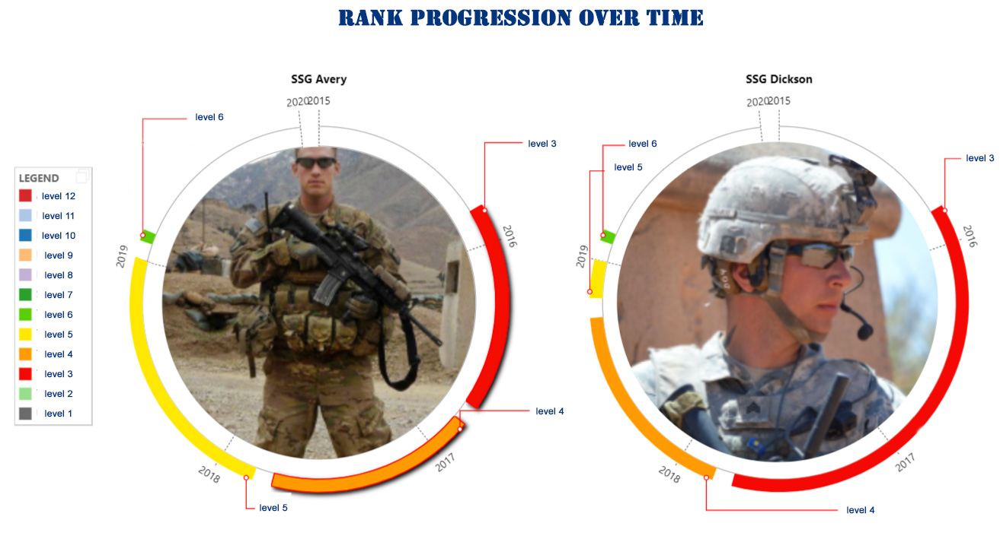

# Interview Exercise

## Build This

- You should have a UI that display more than one soldier.
- The elements that should be visible:
  - Image of Soldier,
  - Name,
  - Rank,
  - Rank by date (with date granularity to be decided by developer being visible).
- Provide an input per solider to allow us to promote solider to new rank and provide real time feedback to the UI.

==================================================================

### While we will be evaluating "everything", commentary can *replace actual development*

- Code:  platform selection, design, methodology, flexibility, extensibility, technology, testing
- Security
- Accessibility, usability
- Visuals
- Documentation

---

## Documentation

## Evaluation Criteria:

The project was not completed fully. It was my goal to incorporate all the features required, but due to the time constraints the full potential of the project was not realized.

View the [Web App Link](https://dev.d29dagv6f457zk.amplifyapp.com/) 

I&#39;ve also attached the code files for review.

Tasks Status:

**X. UI that display more than one soldier.**

**X. Image of Soldier, Name, Rank, Rank by date**

**X. Provide an input per solider to allow us to promote solider to new rank**

**O. Provide real time feedback to the UI.**

## Code

### Platform selection

-Amazon Web Services (AWS)

- Most familiar with available service offerings.
- Good at setting up environments
- Provide many options/avenues for development
- Low cost and Low risk for failures

After several attempts decided on Small Scale app.

-AWS Amplify – &quot;Everything you need to develop &amp; deploy cloud-powered mobile and web apps. Build, deploy, and host modern web apps. Amplify Framework provides a command-line interface (CLI) and library for simplifying mobile and web development.&quot;

- Simple setup, build and deploy

- Serverless

- Free Tier to low cost

- Link to Source Control, other AWS services.

- DynamoDB – Serverless, NoSQL database.

- forgiving when data is messy

- users may be uninitiated

- corrupted malformed data deleted or modified quickly though AWS console.

- Lambda – Serverless

- Free to low cost

- No servers/VMs

- self testing debug quickly

### Design

Completed

- Code in text editor,
- Uploaded to Amplify as a .zip file,
- Amplify build and deployed the code.
- WebApp &quot;submit&quot; event triggers API gateway
- Lambda, triggers a function
- IAM access roles and policies restrict access
- User input is written to DynamoDB
- Website password protected-
- \*\* The password on the site is only meant for restricting access to sites in Development (the method used is a single user password. Not true sign on option.

Website url = https://dev.d29dagv6f457zk.amplifyapp.com/

Not Completed

- Changes to DynamoDB trigger Lambda Function
- Changes in DB written to file pushed to CI/CD pipeline
- Triggers build
- Build deploys updated app with new/updated soldier information.

&#39;Flexibility,

Web app can be quickly updated, built, and deployed.

Rollbacks are quick and easy. Builds are logged and saved; Find the last good one and reload it.

\*\* Can still be launched in large servers and DBs if it most be.

Option #2 [CloudFormation Templates](https://s3.amazonaws.com/cloudformation-templates-us-east-1/LAMP_Single_Instance.template)

- Create a LAMP stack on a single Amazon EC2 instance with a local MySQL database for storage.
- Selected for ease of launching stack, setting parameters and being able to access infrastructure in minutes of launch.
  - Set up MySQL Database from AWS Console (ie user, password, DB name, etc.)
- AWS CloudFormation Application Framework template also available for increased scalability.
  - Creates a LAMP stack on Amazon EC2 instances in an Auto Scaling group with a multi-AZ Amazon RDS database instance for storage.
- CloudFormation Templates can be created to meet individual uses-cases as well.

### Extensibility,

Serverless – only pay for what you use. The time it takes to execute the code is what you are paying for.

AWS touts unlimited storage, and cost is only for what is used.

### Testing,

Serverless applications such a Lambda and Amplify provide testing of code prior to deployments.

Additionally, Jenkins, GitHub and Code Pipline all provide code review and testing options, not to mention tools like &#39;npm&#39; that check and compile code.

### Security,

The Apps can be secured access policies as well as user rules etc. Additionally, AWS has a Government cloud AZ, so development in there my be a better option as options are strictly controlled.

## Development Summary

The project had some glaring concerns – scope being the single largest. When it comes to the military or Government in general, there is an almost incalculable number of regulations, laws, mandates, orders, memorandums, policies, and the list goes on. Is the intended audience low level NCO&#39;s using the app to track a handful of soldiers or a Battalion Commander tracking hundred? Who has access to the app? Is the app violating any rules?
